podium_git.R
================
scherbak
2024-01-22

processing is split across small steps (df.1, df.2, … df.22 for easier
interpretation)

``` r
library(DBI)
require(tidyverse)
```

    ## Loading required package: tidyverse

    ## ── Attaching core tidyverse packages ──────────────────────── tidyverse 2.0.0 ──
    ## ✔ dplyr     1.1.3     ✔ readr     2.1.4
    ## ✔ forcats   1.0.0     ✔ stringr   1.5.0
    ## ✔ ggplot2   3.4.4     ✔ tibble    3.2.1
    ## ✔ lubridate 1.9.2     ✔ tidyr     1.3.0
    ## ✔ purrr     1.0.2     
    ## ── Conflicts ────────────────────────────────────────── tidyverse_conflicts() ──
    ## ✖ dplyr::filter() masks stats::filter()
    ## ✖ dplyr::lag()    masks stats::lag()
    ## ℹ Use the conflicted package (<http://conflicted.r-lib.org/>) to force all conflicts to become errors

load MIMIC-III derived and main data from physionet, requires physionet
account see <https://physionet.org/content/mimiciii/1.4/> and click on
“Request access using Google BigQuery” derived data contains a lot of
useful abstractions like height, weight, blood pressure, elixhauser
scores, etc. we don’t need to work with raw data or ICD9 codes directly
connection to derived MIMIC data

``` r
con.1 <- dbConnect(  
  bigrquery::bigquery(),
  project = "physionet-data",
  dataset = "mimiciii_derived",
)
```

connection to primary MIMIC data

``` r
con.2 <- dbConnect(
  bigrquery::bigquery(),
  project = "physionet-data",
  dataset = "mimiciii_clinical"
)
```

Auth bigquery using gmail

``` r
bigrquery::bq_auth(email = "YOUR@EMAIL")  
```

Read tables with metrics required for analysis

``` r
hw.iii=dbReadTable(con.1,'heightweight') #' height and weight data
icu.iii=dbReadTable(con.2,'icustays') ## icu stays 
elix.iii=dbReadTable(con.1,'elixhauser_quan_score') ## elixhauser score
elix.iii.2=dbReadTable(con.1,'elixhauser_quan') ## elixhauser score, including depression, substance abuse
echo.iii=dbReadTable(con.1,'echodata_structured') ## echo data including blood pressure
if (file.exists('labevents'))    ### for faster future runs we save variables in local files
labevents=readRDS('labevents') else 
{
labevents=dbReadTable(con.2,'labevents')    #' load all lab events
saveRDS(labevents,'labevents')
}
a1c=labevents %>% filter(ITEMID==50852|ITEMID==50854)  ## A1C from lab events
c.protein=labevents %>% filter(ITEMID==50889)  ## c protein from lab events
chol=labevents %>% filter(ITEMID==50907) #' cholesterol from lab events
```

These 3 MIMIC-iii files (patients, admissions, textnotes) can be
downloaded from physionet <https://physionet.org/content/mimiciii/1.4/>

``` r
pat=read.csv('PATIENTS.csv')
adm=read.csv('ADMISSIONS.csv')
not=read.csv('NOTEEVENTS.csv')
```

we will only use discharge summaries from notes corpus

``` r
df.1=
  not %>% tidytable::filter(CATEGORY=='Discharge summary')  
```

extract social history section of the note with reg exp, we try
different matches like all caps, and others, and then combine them.

``` r
df.2=
  df.1 %>% 
  tidytable::mutate(text=str_match(tolower(TEXT) %>% gsub('[\r\n]',' ',.),'social history.[ ]*(.*)family history')[,2]) %>% 
  filter(!is.na(text))

df.2.other=
df.1 %>% 
  tidytable::mutate(text=str_match(tolower(TEXT) %>% gsub('[\r\n]',' ',.),'social history.[ ]*(.*)family history')[,2]) %>% 
  filter(is.na(text)) 

df.2.other.2=
  df.2.other %>%
  tidytable::mutate(text=str_match(TEXT %>% gsub('[\r\n]',' ',.),'SOCIAL HISTORY.[ ]*(.*?)[A-Z]+:')[,2]) %>% 
  filter(!is.na(text))

df.2.other.3=
  df.2.other %>%
  tidytable::mutate(text=str_match(TEXT %>% gsub('[\r\n]',' ',.),'Social History.[ ]*(.*?)[A-Z]+:')[,2]) %>% 
  filter(!is.na(text))
df.2.all=bind_rows(df.2,df.2.other.2,df.2.other.3) %>% mutate(TEXT=text)
```

now we will annotate notes with living with label helper function

``` r
get.maxscore=function(text,pipe=pipe)
{
  p=pipe(text)
  print(p)
  (p %>% unlist)[which((p %>% unlist %>% names) =='score')] %>% which.max
}
```

we will have to use reticulate to use UC NLP models, we will need python
with prerequisites: transformers, spacy see documentation for UC CNN and
bag of words (BOW) models for dependencies and installation
<https://github.com/BCHSI/social-determinants-of-health-clbp>

``` r
reticulate::use_python('/usr/bin/python3')
library(reticulate)
library(tidyverse)
mod='hf.model.lw.shac' ## SHAC model
```

install python transformers before running next line

``` r
tf=import('transformers')
m=tf$AutoModelForSequenceClassification$from_pretrained(mod)
t=tf$AutoTokenizer$from_pretrained(mod)
pipe = tf$TextClassificationPipeline(model=m, tokenizer=t,padding="max_length",truncation=T, return_all_scores=T)

levels=c("family", "others", "spouse", "alone", "partner", "not given")
```

annotate notes, long process afterwards get factor representation
instead of numbers for lw (living with) label

``` r
if (file.exists('df.4'))    ### for faster future runs we save variables in local files and load them from disk if they exist on disk
  df.4=readRDS('df.4') else {
df.3=df.2.all %>% rowwise %>% mutate(label=list(get.maxscore(TEXT,pipe)))
df.4=df.3 %>% ungroup %>% mutate(lw.label=factor(unlist(label),levels=1:length(levels),
                                                             labels=c(levels))) 
saveRDS(df.4,'df.4')
}
```

this function applies NLP model to texts in parallel to extract label\_
(probably shorter function could be written but I am not expert in
reticulate/python combo)

``` r
nlp_extr.all=function(texts){
  docs=nlp$pipe(texts)
  ap=function(i) {
    l=list()
    for (ent in i$ents)
      l=append(l,list(c(
        ent$label_ )))
    return(l)
  }
  return(iterate(docs,ap,simplify = F) )
}
```

we will use spacy via reticulate to apply CNN model for extraction of
marital status perform annotation, long process ~several hours
annotations come in complex format, which we will need to work with to
extract the actual label processing continues, we also want to only use
marital status, since model extracts many other label categories too at
last set names: cnn.label will be marital status extracted by CNN

``` r
if (file.exists('df.8'))    ### for faster future runs we save variables in local files and load them from disk if they exist on disk
  df.8=readRDS('df.8') else {
spacy=import('spacy')
nlp=spacy$load("en_sdoh_cnn_ner_cui")
df.5=df.4 %>% mutate(extr=nlp_extr.all(TEXT))

df.6=
  df.5 %>% 
  rowwise %>% 
  mutate(extr.na=max(ifelse(grepl("Marital",extr),1,0))) %>% 
  ungroup %>% 
  unnest(extr,keep_empty = T) %>% 
  unnest_wider(extr,names_sep='_')  %>% 
  separate(extr_1,sep=':',into=c('category','label')) 

df.7=
  df.6 %>% 
  mutate(label=ifelse(is.infinite(extr.na)|extr.na==0,'not given',label)) %>% 
  mutate(category=ifelse(is.infinite(extr.na)|extr.na==0,'Marital_or_partnership_status',category)) %>% 
  filter(category %in% c("Marital_or_partnership_status")) %>% 
  group_by(HADM_ID,category,TEXT) %>% 
  mutate(label=ifelse(!all(is.na(label)),tail(names(sort(table(label))), 1),label)) %>%  #' in case one text gets several marital status predictions, we take the most frequent occuring label
  slice(1) %>% 
  ungroup %>% 
  pivot_wider(names_from=category,values_from=label)  

df.8=
  df.7 %>% 
  rename(cnn.label="Marital_or_partnership_status") %>% 
  mutate(cnn.label=trimws(tolower(cnn.label))) 

saveRDS(df.8,'df.8') #Save for faster access

}
```

We are done with CNN model, now we can extract marital status using Bag
of words model (BOW) annotation is long process do similiar processing
for BOW model as for CNN set names, hybrid.label will be BOW model
marital status df.13: now an important step, we recode partnered
patients using lw label. We consider partnered only patients who live
with their partner, girlfriend, boyfriend or significant other All other
partnered are considered dating At last (df.14) we do majority voting,
if 2 out 3 votes match on marital status we use the label, otherwise we
set to NA

``` r
if (file.exists('df.14'))    ### for faster future runs we save variables in local files and load them from disk if they exist on disk
df.14=readRDS('df.14') else
{
nlp=spacy$load("en_sdoh_bow_cui") #' restart r session, if reticulate function doesn't work with other model in cache
df.9=df.8 %>% mutate(extr=nlp_extr.all(TEXT))

df.10=
  df.9 %>% 
  rowwise %>% 
  mutate(extr.na=max(ifelse(grepl("Marital",extr),1,0))) %>% 
  ungroup %>% 
  unnest(extr,keep_empty = T) %>% 
  unnest_wider(extr,names_sep='_')  %>% 
  separate(extr_1,sep=':',into=c('category','label'))

df.11=
  df.10 %>% 
  mutate(label=ifelse(is.infinite(extr.na)|extr.na==0,'not given',label)) %>% 
  mutate(category=ifelse(is.infinite(extr.na)|extr.na==0,'Marital_or_partnership_status',category)) %>% 
  filter(category %in% c("Marital_or_partnership_status")) %>% 
  group_by(HADM_ID,category,TEXT) %>% 
  mutate(label=ifelse(!all(is.na(label)),tail(names(sort(table(label))), 1),label)) %>% 
  slice(1) %>% 
  ungroup %>% 
  pivot_wider(names_from=category,values_from=label)  


df.12=
  df.11 %>% 
  rename(hybrid.label="Marital_or_partnership_status") %>% 
  mutate(hybrid.label=trimws(tolower(hybrid.label))) 

df.13= 
  df.12 %>% 
  select(-extr.na) %>% 
  mutate(across(contains("label"),function(x) case_when(x=='single person'~'single',   #' minor recoding of marital status labels is done with case_when
                                                        x=='life partner'~'partner',
                                                        x=='na'~'not given',
                                                        is.na(x)~'not given',
                                                        x==''~'not given',
                                                        x=='unknown (default)'~'not given',
                                                        .default=x))) %>%
  mutate(hybrid.label=case_when(
    hybrid.label=="partner"&lw.label=="partner"~hybrid.label,
    hybrid.label=="partner"&lw.label=="family"~"dating",
    hybrid.label=="partner"&lw.label=="others"~"dating",
    hybrid.label=="partner"&lw.label=="alone"~"dating",
    .default = hybrid.label
  )) %>% mutate(cnn.label=case_when(
    cnn.label=="partner"&lw.label=="partner"~cnn.label,
    cnn.label=="partner"&lw.label=="family"~"dating",
    cnn.label=="partner"&lw.label=="others"~"dating",
    cnn.label=="partner"&lw.label=="alone"~"dating",
    .default = cnn.label 
  )) 

df.14=
  df.13 %>% 
  left_join(adm,by=c("SUBJECT_ID","HADM_ID")) %>% 
  mutate(label=case_when(
    cnn.label==hybrid.label~hybrid.label,
    cnn.label==MARITAL_STATUS~MARITAL_STATUS,
    MARITAL_STATUS==hybrid.label~hybrid.label,
    .default = "undecided"
  )) %>% 
  mutate(across(contains('vote'),function(x) replace_na(x,"not given"))) %>% 
  mutate(structured.label=MARITAL_STATUS) %>% 
  mutate(across(contains("label"),function(x) case_when(x=='single person'~'single',
                                                        x=='life partner'~'partner',
                                                        x=='na'~'not given',
                                                        is.na(x)~'not given',
                                                        x==''~'not given',
                                                        x=='unknown (default)'~'not given',
                                                        .default=x))) %>%
  mutate(across((contains('label')&!contains('alone'))&!contains('ref.livingwith')|contains('vote'),~factor(.x)))#,levels=c('single','not given','married','partner','engaged to be married','widowed','separated','divorced','dating','relationship breakdown'))))  
saveRDS(df.14,'df.14')
}
```

tidytable speeds up operations

``` r
library(tidytable) 
```

    ## Warning: tidytable was loaded after dplyr.
    ## This can lead to most dplyr functions being overwritten by tidytable functions.

    ## Warning: tidytable was loaded after tidyr.
    ## This can lead to most tidyr functions being overwritten by tidytable functions.

    ## 
    ## Attaching package: 'tidytable'

    ## The following objects are masked from 'package:dplyr':
    ## 
    ##     across, add_count, add_tally, anti_join, arrange, between,
    ##     bind_cols, bind_rows, c_across, case_match, case_when, coalesce,
    ##     consecutive_id, count, cross_join, cume_dist, cur_column, cur_data,
    ##     cur_group_id, cur_group_rows, dense_rank, desc, distinct, filter,
    ##     first, full_join, group_by, group_cols, group_split, group_vars,
    ##     if_all, if_any, if_else, inner_join, is_grouped_df, lag, last,
    ##     lead, left_join, min_rank, mutate, n, n_distinct, na_if, nest_by,
    ##     nest_join, nth, percent_rank, pick, pull, recode, reframe,
    ##     relocate, rename, rename_with, right_join, row_number, rowwise,
    ##     select, semi_join, slice, slice_head, slice_max, slice_min,
    ##     slice_sample, slice_tail, summarise, summarize, tally, top_n,
    ##     transmute, tribble, ungroup

    ## The following objects are masked from 'package:purrr':
    ## 
    ##     map, map_chr, map_dbl, map_df, map_dfc, map_dfr, map_int, map_lgl,
    ##     map_vec, map2, map2_chr, map2_dbl, map2_df, map2_dfc, map2_dfr,
    ##     map2_int, map2_lgl, map2_vec, pmap, pmap_chr, pmap_dbl, pmap_df,
    ##     pmap_dfc, pmap_dfr, pmap_int, pmap_lgl, pmap_vec, walk

    ## The following objects are masked from 'package:tidyr':
    ## 
    ##     complete, crossing, drop_na, expand, expand_grid, extract, fill,
    ##     nest, nesting, pivot_longer, pivot_wider, replace_na, separate,
    ##     separate_longer_delim, separate_rows, separate_wider_delim,
    ##     separate_wider_regex, tribble, uncount, unite, unnest,
    ##     unnest_longer, unnest_wider

    ## The following objects are masked from 'package:tibble':
    ## 
    ##     enframe, tribble

    ## The following objects are masked from 'package:stats':
    ## 
    ##     dt, filter, lag

    ## The following object is masked from 'package:base':
    ## 
    ##     %in%

We will get the latest discharge summary if there are multiple entries
during one admission

``` r
  df.15=
    df.14 %>% 
  #  bind_rows(df.nursing) %>% 
  #  mutate(label.present=ifelse(is.na(label)|label=='not given',0,1)) %>% 
    filter(!is.na(label),label!='not given') %>% 
    group_by(HADM_ID) %>% 
    arrange(desc(CHARTDATE)) %>% 
    slice(1) %>% 
    ungroup %>% 
    select(-contains("ROW_ID"))  
```

The next calculations combine social history notes with metrics such as
height, weight, patient details, admission details, A1C, etc.

``` r
  detach('package:tidytable') #' tidy fill doesn't work correctly with tidytable
  require(tidyverse)
  df.16=
  df.15 %>% 
  left_join(elix.iii %>% left_join(elix.iii.2),
            by=c("HADM_ID"="hadm_id")) %>% 
  left_join(echo.iii %>% 
              filter(!is.na(hadm_id)) %>% 
              group_by(hadm_id) %>% 
              arrange(chartdate) %>% 
              slice(1) %>% 
              ungroup 
            ,by=c("HADM_ID"="hadm_id")) %>%  
  #left_join(adm) %>% select(-ROW_ID) %>% 
  left_join(pat) %>% 
  select(-contains('ROW_ID')) %>% 
  left_join(icu.iii) %>% 
  left_join(hw.iii, by=c("ICUSTAY_ID"="icustay_id")) %>% 
  left_join(a1c %>% 
              filter(!is.na(HADM_ID),ITEMID==50852) %>% select(HADM_ID,ITEMID,VALUENUM) %>% 
              distinct(HADM_ID,ITEMID,.keep_all=T), by='HADM_ID')
```

    ## Joining with `by = join_by(hadm_id)`
    ## Joining with `by = join_by(SUBJECT_ID)`
    ## Joining with `by = join_by(SUBJECT_ID, HADM_ID)`

add other metrics: protein and cholesterol levels if there are multiple
measurements in lab events per admission take only one metric per
admission

``` r
  df.17=
  df.16 %>% 
  tidytable::left_join(c.protein %>% select(HADM_ID,VALUENUM) %>% 
                         rename(reactive.protein=VALUENUM) %>% distinct(HADM_ID,.keep_all=T),
                       by='HADM_ID') %>% 
  tidytable::left_join(chol %>% select(HADM_ID,VALUENUM) %>% 
                         rename(cholesterol.total=VALUENUM) %>% distinct(HADM_ID,.keep_all=T),
                       by='HADM_ID') 
```

convert datetime to date format and set weight to first measurement of
weight

``` r
  df.18=
  df.17 %>%   
  mutate(ADMITTIME=lubridate::as_date(ADMITTIME)) %>%   
  mutate(weight=weight_first)
```

delete entries, where there is no marital status detected, calculate
patient’s age and time between admissions delete outliers (aged \> 120
and aged \< 18)

``` r
  df.19=
  df.18 %>% 
  filter(label!='not given',label!='na',!is.na(label)) %>% 
  group_by(SUBJECT_ID) %>% 
  arrange(ADMITTIME,.by_group=T) %>% 
  mutate(time=ADMITTIME-tidytable::lag(ADMITTIME)) %>% 
  ungroup %>% 
  mutate(DOB=lubridate::as_date(DOB)) %>% 
  mutate(age=trunc((ADMITTIME-DOB)/365)) %>% 
  mutate(age=as.integer(age)) %>%  
  filter(age<120,age>=18)  
```

we select only married, divorced and single people since UC model showed
high precision for these groups only, other groups are not reliable we
select only latest admission per patient

``` r
  df.20=
  df.19 %>% 
  # filter(label %in% c("married",
  #                     "single person",
  #                     "divorced"
  # )) %>%
  group_by(SUBJECT_ID) %>%
  mutate(admissions=n()) %>%      #' count number of admission per patient
  mutate(more.than.one.admission=ifelse(admissions>1,T,F)) %>%
  arrange(desc(ADMITTIME)) %>%
  slice(1) %>%
  ungroup %>%
  #rename(ADMITDATE=ADMITTIME) %>% 
  #left_join(adm,by='HADM_ID',copy=F) %>%   
  mutate(DISCHTIME=lubridate::as_datetime(DISCHTIME)) %>% 
  mutate(ADMITTIME=lubridate::as_datetime(ADMITTIME)) %>% 
  mutate(days.to.discharge=as.integer(DISCHTIME-ADMITTIME)/(60*24)) %>% 
  # mutate(label=factor(label,c( "single person","partner", "married", 
  #                              "divorced", "separated", "widowed"),ordered=T)) %>%
  mutate(label=fct_drop(label)) 

  df.20$label %>% table
```

    ## .
    ##    single   married   partner   widowed separated  divorced    dating 
    ##       327     12578       810       774        15       739       264

bin admissions into groups

``` r
  df.20.married=df.20 %>%filter(label=='married') 
  df.20.single=df.20 %>%filter(label=='single') 
  df.20.divorced=df.20 %>% filter(label=='divorced')
  df.20.dating=df.20 %>% filter(label=='dating')
  df.20.partner=df.20 %>% filter(label=='partner')
  df.20.widowed=df.20 %>% filter(label=='widowed')
```

we can see that mean ages are quite different , we need to downsample
larger groups using weights which are manually picked to make even
groups

``` r
df.20.married$age %>% mean
```

    ## [1] 64.47671

``` r
df.20.single$age %>% mean
```

    ## [1] 53.11009

``` r
df.20.divorced$age %>% mean
```

    ## [1] 59.4479

``` r
df.20.dating$age %>% mean
```

    ## [1] 48.12879

``` r
df.20.widowed$age %>% mean
```

    ## [1] 76.31783

``` r
df.20.partner$age %>% mean
```

    ## [1] 49.63827

``` r
df.20.dating$age %>% mean
```

    ## [1] 48.12879

``` r
# df.20.married.2=df.20.married %>%
#   mutate(sample_weight=1/age^3.9) %>%
#   slice_sample(n=ceiling(nrow(.)*0.12),weight_by = sample_weight)
# df.20.divorced.2=df.20.divorced %>%
#   mutate(sample_weight=1/age^6) %>%
#   slice_sample(n=ceiling(nrow(.)*0.3),weight_by = sample_weight)
# df.20.widowed.2=df.20.widowed %>%
#   mutate(sample_weight=1/age^40) %>%
#   slice_sample(n=ceiling(nrow(.)*0.1),weight_by = sample_weight)
# df.20.single.2=df.20.single %>%
#   mutate(sample_weight=1/age^5) %>%
#   slice_sample(n=ceiling(nrow(.)*0.8),weight_by = sample_weight)

set.seed(1)
df.20.married.2=df.20.married %>%
  mutate(sample_weight=1/age^2.5) %>%
  slice_sample(n=ceiling(nrow(.)*0.3),weight_by = sample_weight)
df.20.married.2$age %>% mean
```

    ## [1] 57.29915

``` r
df.20.divorced.2=df.20.divorced %>%
  mutate(sample_weight=1/age^2) %>%
  slice_sample(n=ceiling(nrow(.)*0.8),weight_by = sample_weight)
df.20.divorced.2$age %>% mean
```

    ## [1] 57.53885

``` r
df.20.widowed.2=df.20.widowed %>%
  mutate(sample_weight=1/age^13) %>%
  slice_sample(n=ceiling(nrow(.)*0.08),weight_by = sample_weight)
df.20.widowed.2$age %>% mean
```

    ## [1] 56.6129

``` r
df.20.single.2=df.20.single %>%
  mutate(sample_weight=1/age^-3) %>%
  slice_sample(n=ceiling(nrow(.)*0.8),weight_by = sample_weight)
df.20.single.2$age %>% mean
```

    ## [1] 57.55344

``` r
df.20.dating.2=df.20.dating %>%
  mutate(sample_weight=1/age^-3.5) %>%
  slice_sample(n=ceiling(nrow(.)*0.6),weight_by = sample_weight)
df.20.dating.2$age %>% mean
```

    ## [1] 57.22642

``` r
df.20.partner.2=df.20.partner %>%
  mutate(sample_weight=1/age^-4) %>%
  slice_sample(n=ceiling(nrow(.)*0.6),weight_by = sample_weight)
df.20.partner.2$age %>% mean
```

    ## [1] 57.75926

a test to check how similiar are the variances, making variances similar
is too difficult using this sample size

``` r
car::leveneTest(age~label,bind_rows(df.20.divorced.2,df.20.married.2))
```

    ## Levene's Test for Homogeneity of Variance (center = median)
    ##         Df F value    Pr(>F)    
    ## group    1  34.206 5.319e-09 ***
    ##       4364                      
    ## ---
    ## Signif. codes:  0 '***' 0.001 '**' 0.01 '*' 0.05 '.' 0.1 ' ' 1

``` r
car::leveneTest(age~label,bind_rows(df.20.partner,df.20.married.2))
```

    ## Levene's Test for Homogeneity of Variance (center = median)
    ##         Df F value Pr(>F)
    ## group    1   0.195 0.6588
    ##       4582

``` r
car::leveneTest(age~label,bind_rows(df.20.widowed.2,df.20.married.2))
```

    ## Levene's Test for Homogeneity of Variance (center = median)
    ##         Df F value    Pr(>F)    
    ## group    1  14.677 0.0001296 ***
    ##       3834                      
    ## ---
    ## Signif. codes:  0 '***' 0.001 '**' 0.01 '*' 0.05 '.' 0.1 ' ' 1

``` r
car::leveneTest(age~label,bind_rows(df.20.partner.2,df.20.dating.2))
```

    ## Levene's Test for Homogeneity of Variance (center = median)
    ##        Df F value    Pr(>F)    
    ## group   1   12.62 0.0004095 ***
    ##       643                      
    ## ---
    ## Signif. codes:  0 '***' 0.001 '**' 0.01 '*' 0.05 '.' 0.1 ' ' 1

``` r
car::leveneTest(age~label,bind_rows(df.20.partner.2,df.20.single.2))
```

    ## Levene's Test for Homogeneity of Variance (center = median)
    ##        Df F value    Pr(>F)    
    ## group   1  14.986 0.0001178 ***
    ##       746                      
    ## ---
    ## Signif. codes:  0 '***' 0.001 '**' 0.01 '*' 0.05 '.' 0.1 ' ' 1

variances can be checked on histogram

``` r
layout(matrix(c(1, 2, 3, 4,5,6), nrow = 2, 
              ncol = 3, byrow = TRUE)) 
df.20.married.2$age %>% hist
df.20.divorced.2$age %>% hist
df.20.widowed.2$age %>% hist
df.20.dating.2$age %>% hist
df.20.partner.2$age %>% hist
df.20.single.2$age %>% hist
```

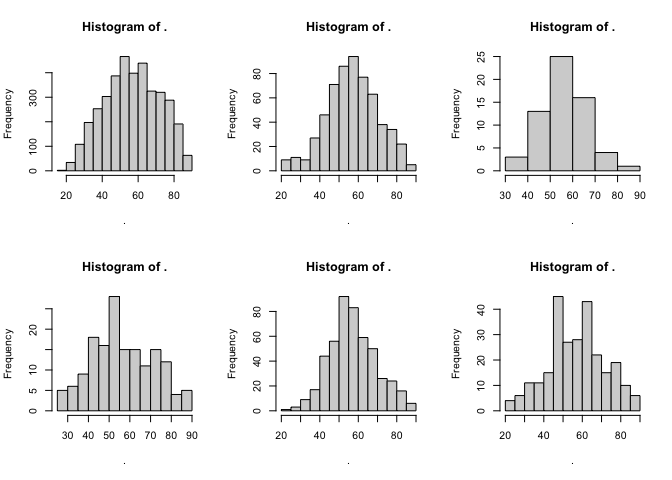<!-- -->

``` r
df.21=bind_rows(df.20.married.2
                ,df.20.divorced.2
                ,df.20.widowed.2
                ,df.20.dating.2
                ,df.20.partner.2
                ,df.20.single.2)
```

Now average age is ~53

``` r
require(ggpubr)
```

    ## Loading required package: ggpubr

Build boxplot comparing continous health metrics between single ,
married and divorced groups

``` r
bxp=
#   bind_rows(
#   df.20.married.2,
#   df.20.divorced.2,
#   df.20.single
# ) %>%
  df.21 %>% 
  mutate(DOB=lubridate::as_date(DOB)) %>%  
  mutate(age=trunc(as.integer(lubridate::as_date(ADMITTIME)-DOB)/365)) %>%   
  mutate(age=as.integer(age)) %>% 
  group_by(SUBJECT_ID) %>% 
  #mutate(admissions=n()) %>% 
  arrange(desc(ADMITTIME)) %>% slice(1) %>% ungroup %>% 
  left_join(adm,by='HADM_ID',copy=F)   %>% 
  mutate(DISCHTIME=lubridate::as_datetime(DISCHTIME.x)) %>% 
  mutate(ADMITTIME=lubridate::as_datetime(ADMITTIME.x)) %>% 
  mutate(days.to.discharge=as.integer((DISCHTIME-ADMITTIME)/24)) %>% 
  mutate(weight=ifelse(weight>200|weight<20,NA,weight)) %>% 
  mutate(bpsys=ifelse(bpsys>300,NA,bpsys)) %>% 
  mutate(bpdias=ifelse(bpdias>300,NA,bpdias)) %>% 
  mutate(bpdias=ifelse(bpdias>300,NA,bpdias)) %>% 
  rename(a1c=VALUENUM) %>% 
  pivot_longer(c(#age,
                 admissions,
                 #a1c,
                 #reactive.protein,
                 #weight,
                 #bpsys,bpdias,
                 #cholesterol.total,
                 elixhauser_vanwalraven
                 #days.to.discharge
                 ),
               names_to='vars.orig',values_to='values.orig'
  ) %>%
  ggboxplot(x="label",y="values.orig",fill = "#00AFBB",
            facet.by = "vars.orig",scales = "free")+
  geom_pwc(method='t_test',vjust=2,ref.group=2)

bxp 
```

    ## Warning: Removed 31 rows containing non-finite values (`stat_boxplot()`).

    ## Warning: Removed 31 rows containing non-finite values (`stat_pwc()`).

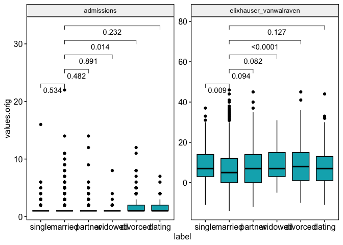<!-- -->

Although there was difference, especially in A1C levels and elixhauser
after adjusting p values no significant changes were detected

``` r
ggadjust_pvalue(
  bxp, p.adjust.method = "holm",
  symnum.args = list(cutpoints = c(0, 0.0001, 0.001, 0.01, 0.05, Inf), symbols = c("****", "***", "**", "*", "")),
  label = "p adjusted={p.adj.format} {p.adj.signif}", hide.ns = F
)
```

    ## Warning: Removed 31 rows containing non-finite values (`stat_boxplot()`).

    ## Warning: Removed 31 rows containing non-finite values (`stat_pwc()`).

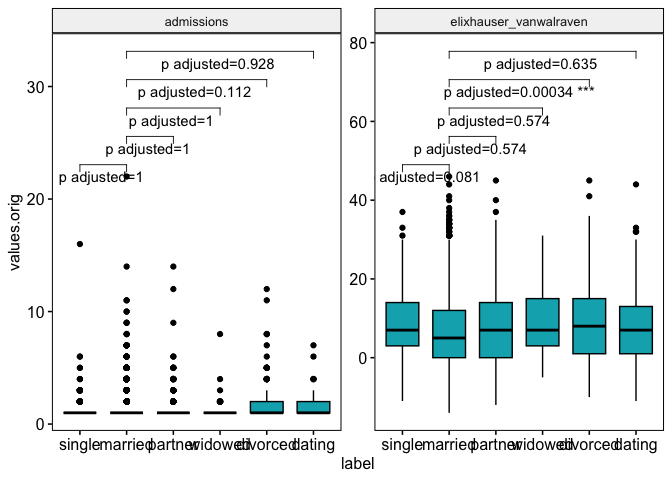<!-- -->

``` r
# bind_rows(
#   df.20.married.2,
#   df.20.divorced.2,
#   df.20.single
# ) %>% 
  df.21 %>% 
  left_join(adm,by='HADM_ID',copy=F)   %>% 
  mutate(DISCHTIME=lubridate::as_datetime(DISCHTIME.x)) %>% 
  mutate(ADMITTIME=lubridate::as_datetime(ADMITTIME.x)) %>% 
  mutate(days.to.discharge=as.integer(DISCHTIME-ADMITTIME)/(60*24)) %>% 
  pivot_longer(c(depression,drug_abuse,alcohol_abuse),
               names_to='vars.orig',values_to='values.orig'
  ) %>%
  drop_na(values.orig) %>% 
  mutate(values.orig=as.logical(values.orig)) %>% 
  group_by(vars.orig,label) %>% add_tally(name='nn') %>% 
  group_by(vars.orig,label,values.orig) %>%  add_tally %>%
  filter(values.orig==T) %>% 
  select(n,nn) %>% distinct %>% 
  mutate(c.min=binom.test(x=n,n=nn)$conf.int[1],c.max=binom.test(x=n,n=nn)$conf.int[2]) %>% 
  mutate(vars.orig=gsub('[_.]',' ',vars.orig)) %>%  
  mutate(label=fct_recode(label,'single'='single person')) %>% 
  filter(vars.orig!='more than one admission') %>% 
    mutate(label=factor(label,levels = c("single", "dating",
                                         "married", "partner", "widowed", "separated", "divorced"))) %>% 
    
  ggplot(aes(y=n*100/nn,x=label))+
  geom_col(width=0.62,aes(fill=label)) + 
  geom_errorbar(aes(ymin=c.min*100,ymax=c.max*100),position='dodge',width = 0.2)+
  ylab('Percentage of patients with the given diagnosis')+
  xlab("")+
  theme_minimal()+
  #theme(text = element_text(size=22))+       ## for print only
  scale_fill_manual(values=    c("#003f5c",
                                   #"#2f4b7c",
                                   "#665191",
                                   "#a05195",
                                   #"#d45087",
                                   "#f95d6a",
                                   "#ff7c43",
                                   "#ffa600"
    ))+
   theme(legend.position = "none")+
   theme( axis.text.x = element_text( angle = 45 ,
                                      vjust = 1 ,
                                      hjust = 1 ) )+
   theme(aspect.ratio = 2.3/1)+
   facet_grid(~vars.orig,scales='free')
```

    ## Adding missing grouping variables: `vars.orig`, `label`, `values.orig`

    ## Warning: There were 18 warnings in `mutate()`.
    ## The first warning was:
    ## ℹ In argument: `label = fct_recode(label, single = "single person")`.
    ## ℹ In group 1: `vars.orig = "alcohol abuse"`, `label = single`, `values.orig =
    ##   TRUE`.
    ## Caused by warning:
    ## ! Unknown levels in `f`: single person
    ## ℹ Run `dplyr::last_dplyr_warnings()` to see the 17 remaining warnings.

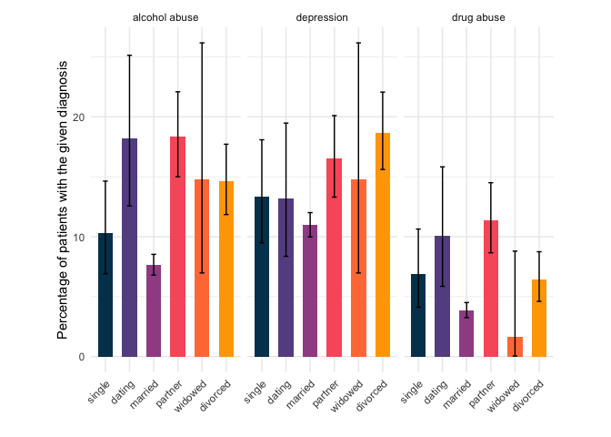<!-- -->

``` r
  #' We group data frame by patient and calculate difference of marital status and health metrics between admissions
df.21=
  df.19 %>% 
  filter(label %in% c("married",
                       "single person",
                       "divorced",
                       "dating",
                      "widowed",
                      "single",
                      "partner"
  )) %>%
  ungroup %>% 
  group_by(SUBJECT_ID) %>% 
  arrange(ADMITTIME) %>% 
  mutate(time=ADMITTIME-dplyr::lag(ADMITTIME)) %>% 
  mutate(label.prev=dplyr::lag(label)) %>% 
  #distinct() %>% 
  mutate(
    a1c.delta=(VALUENUM-lag(VALUENUM))/lag(VALUENUM),
    reactive.protein.delta=(reactive.protein-lag(reactive.protein))/lag(reactive.protein),
    weight.delta=abs(weight-lag(weight))/lag(weight),
    BP.dias.delta=(bpsys-lag(bpsys))/lag(bpsys),
    BP.sist.delta=(bpdias-lag(bpdias))/lag(bpdias),
    cholesterol.total.delta=(cholesterol.total-lag(cholesterol.total))/lag(cholesterol.total),
    elixhauser_vanwalraven.delta=(elixhauser_vanwalraven-lag(elixhauser_vanwalraven))/lag(elixhauser_vanwalraven)
  ) %>%
  ungroup 
```

calculate more metrics and ‘change’ column indicating if change in
marital status happened

``` r
df.22=df.21 %>%  
  mutate(DOB=lubridate::as_date(DOB)) %>% 
  mutate(age=as.numeric(trunc((lubridate::as_date(ADMITTIME)-DOB)/365))) %>% 
  group_by(SUBJECT_ID) %>% 
  arrange(ADMITTIME) %>% 
  mutate(     
    depression.delta=depression-lag(depression),  
    alcohol_abuse.delta=alcohol_abuse-lag(alcohol_abuse),
    drug_abuse.delta=drug_abuse-lag(drug_abuse),
    hypertension.delta=hypertension-lag(hypertension),
    metastatic_cancer.delta=metastatic_cancer-lag(metastatic_cancer),
    depression.delta=ifelse(depression.delta==0&depression==1,2,depression.delta),  ### coding schema -1 recovery, 0 - no change, No Dx, 1 - new Dx, 2 - no change, Dx present
    alcohol_abuse.delta=ifelse(alcohol_abuse.delta==0&alcohol_abuse==1,2,alcohol_abuse.delta),
    drug_abuse.delta=ifelse(drug_abuse.delta==0&drug_abuse==1,2,drug_abuse.delta),
    metastatic_cancer.delta=ifelse(metastatic_cancer.delta==0&metastatic_cancer==1,2,metastatic_cancer.delta),
    hypertension.delta=ifelse(hypertension.delta==0&hypertension==1,2,hypertension.delta)
  ) %>% 
  mutate(change=ifelse(label!=label.prev&(label=='married'),"Got married",
                       ifelse(label!=label.prev&label!='married',"Other change",
                              "Unchanged"))) %>% 
  filter(!is.na(change)) %>% 
  ungroup %>% 
  filter(time<=5*365)
  
df.22$change %>% table
```

    ## .
    ##  Got married Other change    Unchanged 
    ##           40           99         5372

``` r
# give.n <- function(x){
#   return(c(y = median(x)*1.25, 
#            label = length(x))) 
#   # experiment with the multiplier to find the perfect position
# }


df.22.married=
  df.22 %>%
  filter(change=='Got married') 

df.22.other=
  df.22 %>%
  filter(change=='Other change')  

df.22.unchanged=
  df.22 %>%
  filter(change=='Unchanged')

df.22.change=bind_rows(df.22.married,df.22.other)
```

groups have different age, we need to downsample again

``` r
df.22.married$age %>% mean
```

    ## [1] 54.15

``` r
df.22.other$age %>% mean
```

    ## [1] 58.61616

``` r
df.22.unchanged$age %>% mean
```

    ## [1] 64.12882

``` r
df.22.change$age %>% mean
```

    ## [1] 57.33094

``` r
df.22.unchanged.2=
  df.22.unchanged %>% ungroup %>% 
  mutate(sample_weight=age^(-3)) %>% 
  slice_sample(n=2500,weight_by = sample_weight)
t.test(df.22.unchanged.2$age,df.22.change$age)
```

    ## 
    ##  Welch Two Sample t-test
    ## 
    ## data:  df.22.unchanged.2$age and df.22.change$age
    ## t = 0.3862, df = 154.22, p-value = 0.6999
    ## alternative hypothesis: true difference in means is not equal to 0
    ## 95 percent confidence interval:
    ##  -2.01584  2.99557
    ## sample estimates:
    ## mean of x mean of y 
    ##  57.82080  57.33094

``` r
df.22.unchanged.2$age %>% mean
```

    ## [1] 57.8208

``` r
df.22.unchanged.2$age %>% hist
```

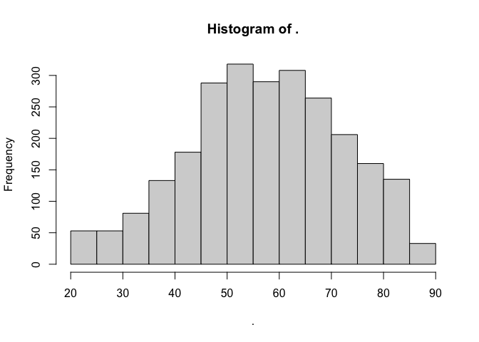<!-- -->

``` r
df.22.change$age %>% hist
```

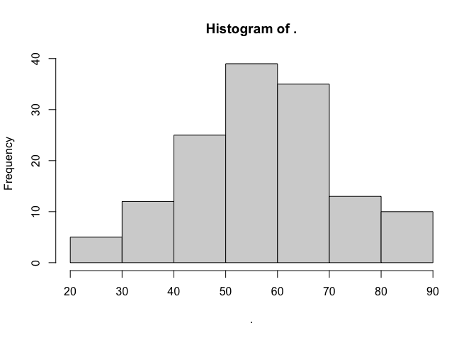<!-- -->

``` r
var.test(df.22.unchanged.2$age,df.22.change$age)
```

    ## 
    ##  F test to compare two variances
    ## 
    ## data:  df.22.unchanged.2$age and df.22.change$age
    ## F = 1.0293, num df = 2499, denom df = 138, p-value = 0.845
    ## alternative hypothesis: true ratio of variances is not equal to 1
    ## 95 percent confidence interval:
    ##  0.7963512 1.2952670
    ## sample estimates:
    ## ratio of variances 
    ##           1.029301

``` r
# df.9.all.younger.51=bind_rows(df.9.unchanged.2,df.9.change) %>% 
#   mutate(sample_weight=age^(-100)) %>% 
#   slice_sample(n=1700,weight_by = sample_weight)
# df.9.all.younger.51$age %>% mean


bxp.change=bind_rows(df.22.unchanged.2,df.22.change) %>% 
  mutate(change=ifelse(change=='Unchanged',change,"Changed")) %>% 
  ungroup %>% 
  filter(time<=5*365) %>% 
  #select(time,contains('label'),everything()) %>% View
  mutate(across(contains("delta")&!contains('depression'),function(x) x*100)) %>%
  pivot_longer(contains('delta'),names_to='vars',values_to = 'values') %>% 
  filter(!(vars %in% c("depression.delta","alcohol_abuse.delta","drug_abuse.delta"))) %>% 
  ggboxplot(x="change",y="values",fill = "#00AFBB",
            facet.by = "vars",scales = "free")+
  geom_pwc(method='t_test',vjust=2)
bxp.change 
```

    ## Warning: Removed 11674 rows containing non-finite values (`stat_boxplot()`).

    ## Warning: Removed 11674 rows containing non-finite values (`stat_pwc()`).

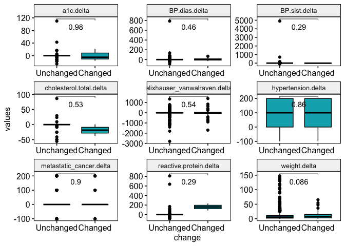<!-- -->

``` r
ggadjust_pvalue(
  bxp.change, p.adjust.method = "holm",
  
  symnum.args = list(cutpoints = c(0, 0.0001, 0.001, 0.01, 0.05, Inf), symbols = c("****", "***", "**", "*", "")),
  label = "p adjusted={p.adj.format} {p.adj.signif}", hide.ns = F
)
```

    ## Warning: Removed 11674 rows containing non-finite values (`stat_boxplot()`).
    ## Removed 11674 rows containing non-finite values (`stat_pwc()`).

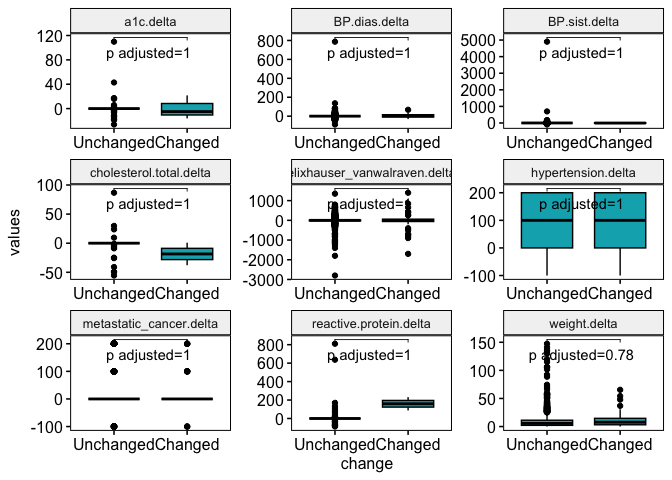<!-- -->

``` r
  df.22 %>% 
  ungroup %>% 
  filter(!is.na(label.prev),label.prev!='na',!is.na(label),label!='na') %>% 
  distinct(SUBJECT_ID,label,label.prev,.keep_all = T) %>%  
  mutate(change=ifelse(label!=label.prev&label=='married',"Changed",#"Got married",
                       ifelse(label!=label.prev&label!='married',"Changed",#"Other change",
                              "Unchanged"))) %>% pull(change) %>% table
```

    ## .
    ##   Changed Unchanged 
    ##       138      3260

Display Changed vs Unchanged chart

``` r
  bind_rows(df.22.unchanged.2,df.22.change) %>% 
  #filter(time<=5*365) %>%
    mutate(change=ifelse(label!=label.prev&label=='married',"Status changed",
                         ifelse(label!=label.prev&label!='married',"Status changed",
                                "Unchanged"))) %>%
  pivot_longer(contains('delta'),names_to='vars',values_to = 'values') %>% 
  #filter(vars %in% names(df.iii.allnotes.combined.4)[which(grepl("delta",names(df.iii.allnotes.combined.4)))]) %>% 
  group_by(vars,change) %>% add_tally(name='tot') %>% 
  group_by(vars,values,change) %>% add_tally(name='n') %>% 
  select(n,tot) %>% distinct %>% 
  mutate(c.min=binom.test(x=n,n=tot)$conf.int[1],c.max=binom.test(n,tot)$conf.int[2]) %>% 
  mutate(vars=gsub(".delta","",vars)) %>% 
  filter(!is.na(values)) %>% 
  mutate(y=n*100/tot) %>% 
  mutate(values=factor(ordered=T,values,levels=c(-1,0,2,1),labels=c("Recovery/ Dx Removed","No Change in Dx - no Dx",'No change in Dx - Dx present','New Dx'))) %>% 
  mutate(vars=gsub("_"," ",vars)) %>% 
  filter(vars %in% c('alcohol abuse','depression','drug abuse')) %>% 
  #filter(vars %in% c('alcohol abuse','depression','drug abuse','hypertension','metastatic cancer')) %>%   # adhoc tests
  mutate(change=fct_recode(change,"Same Marital Status"="Unchanged","Change in Marital Status"="Status changed")) %>% 
  ggplot(aes(y=n*100/tot,x=values,fill=factor(change))) +
  scale_color_brewer(palette = 'Dark2')+
  geom_col(position='dodge2',color='darkgrey')+
  scale_color_hue(direction = -1)+
  scale_fill_manual(values=c('#88CCEE',"white")) +
  geom_errorbar(color='red',aes(ymin=c.min*100,ymax=c.max*100),position=position_dodge(width=0.9),width=0.4)+
  theme_minimal()+
  theme( axis.text.x = element_text( angle = 45 ,
                                     vjust = 1 ,
                                     hjust = 1 ) )+
  theme(aspect.ratio = 2.1/1)+
  theme(legend.title = element_blank(),legend.position = "top")+
  #theme(text = element_text(size=20))+
  facet_wrap(~vars)+
  xlab('')+
  #xlab("Comparative Diagnosis (Dx) Status from the First Admission to Second Admission")+
  ylab('Percentage of Patient admission event pairs')
```

    ## Adding missing grouping variables: `vars`, `values`, `change`

    ## Warning: There were 24 warnings in `mutate()`.
    ## The first warning was:
    ## ℹ In argument: `change = fct_recode(change, `Same Marital Status` =
    ##   "Unchanged", `Change in Marital Status` = "Status changed")`.
    ## ℹ In group 1: `vars = "alcohol abuse"`, `values = Recovery/ Dx Removed`,
    ##   `change = "Status changed"`.
    ## Caused by warning:
    ## ! Unknown levels in `f`: Unchanged
    ## ℹ Run `dplyr::last_dplyr_warnings()` to see the 23 remaining warnings.

    ## Scale for colour is already present.
    ## Adding another scale for colour, which will replace the existing scale.

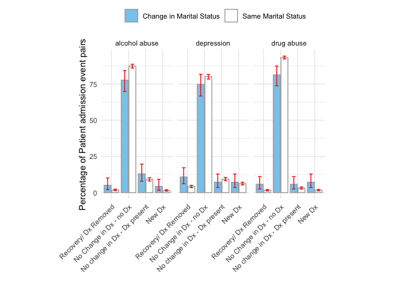<!-- -->

Seperate analysis for “Got married” vs “No change” vs “Other change”

``` r
  bind_rows(df.22.unchanged.2,df.22.change) %>% 
    mutate(change=ifelse(label!=label.prev&(label=='married'),"Got married",
                         ifelse(label!=label.prev&label!='married',"Other change",
                                "Unchanged"))) %>% 
   pivot_longer(contains('delta'),names_to='vars',values_to = 'values') %>%
    #filter(vars %in% c("depression.delta","alcohol_abuse.delta","drug_abuse.delta")) %>% 
    filter(vars %in% c('alcohol_abuse.delta','depression.delta','drug_abuse.delta','hypertension.delta','metastatic_cancer.delta')) %>%   # adhoc tests
    group_by(vars,change) %>% add_tally(name='tot') %>% 
    group_by(vars,values,change) %>% add_tally(name='n') %>% 
    select(n,tot) %>% distinct %>% 
    mutate(c.min=binom.test(x=n,n=tot)$conf.int[1],c.max=binom.test(n,tot)$conf.int[2]) %>% 
    mutate(vars=gsub(".delta","",vars)) %>% 
    filter(!is.na(values)) %>% 
    mutate(y=n*100/tot) %>% 
    mutate(values=factor(ordered=T,values,levels=c(-1,0,2,1),labels=c("Recovery/ Dx Removed","No Change in Dx - no Dx",'No change in Dx - Dx present','New Dx'))) %>% 
    ggplot(aes(y=n*100/tot,x=values,fill=factor(change))) +
    geom_col(position='dodge')+
    geom_errorbar(aes(ymin=c.min*100,ymax=c.max*100),position='dodge')+
    scale_color_hue(direction = -1)+
    scale_fill_manual(values=c('#88CCEE',"white",'black')) +
    facet_wrap(~vars)+theme(legend.title=element_blank())+
    xlab("")+
    ylab('%')
```

    ## Adding missing grouping variables: `vars`, `values`, `change`

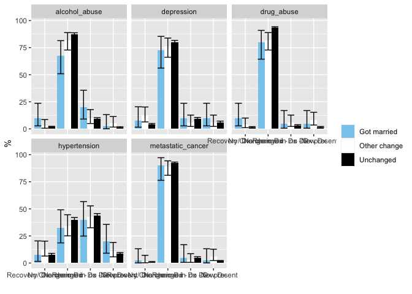<!-- -->

``` r
  #bxp=
    bind_rows(df.22.unchanged.2,df.22.change) %>% 
    mutate(change=ifelse(change=="Unchanged",change,"Status Change")) %>% 
    # filter(change=="Status Change") %>% select(contains('delta')) %>% 
    mutate(DOB=lubridate::as_date(DOB)) %>%  
    mutate(age=trunc(as.integer(lubridate::as_date(ADMITTIME)-DOB)/365)) %>%   
    mutate(age=as.integer(age)) %>% 
    group_by(SUBJECT_ID) %>% 
    mutate(admissions=n()) %>% 
    arrange(desc(ADMITTIME)) %>% slice(1) %>% ungroup %>% 
    left_join(adm,by='HADM_ID',copy=F)   %>% 
    mutate(DISCHTIME=lubridate::as_datetime(DISCHTIME.x)) %>% 
    mutate(ADMITTIME=lubridate::as_datetime(ADMITTIME.x)) %>% 
    mutate(days.to.discharge=as.integer((DISCHTIME-ADMITTIME)/24)) %>% 
    mutate(weight=ifelse(weight>200|weight<20,NA,weight)) %>% 
    mutate(bpsys=ifelse(bpsys>300,NA,bpsys)) %>% 
    mutate(bpdias=ifelse(bpdias>300,NA,bpdias)) %>% 
    mutate(bpdias=ifelse(bpdias>300,NA,bpdias)) %>% 
    rename(a1c=VALUENUM) %>% 
    pivot_longer(c(#age,
      a1c.delta,
      reactive.protein.delta,
      weight.delta,
      BP.sist.delta,
      BP.dias.delta,
      cholesterol.total.delta,
      elixhauser_vanwalraven.delta
      #days.to.discharge
    ),
    names_to='vars.orig',values_to='values.orig'
    ) %>%
    ggboxplot(x="change",y="values.orig",fill = "#00AFBB",
              facet.by = "vars.orig",scales = "free")+
    geom_pwc(method='t_test',vjust=2,ref.group=2)
```

    ## Warning: Removed 8132 rows containing non-finite values (`stat_boxplot()`).

    ## Warning: Removed 8132 rows containing non-finite values (`stat_pwc()`).

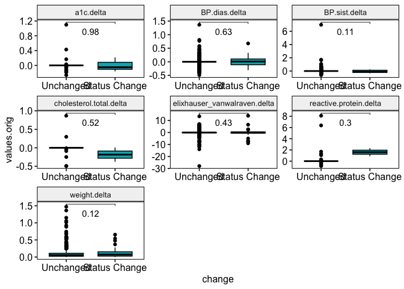<!-- -->

``` r
  bxp 
```

    ## Warning: Removed 31 rows containing non-finite values (`stat_boxplot()`).

    ## Warning: Removed 31 rows containing non-finite values (`stat_pwc()`).

<!-- -->

``` r
  #' after adjusting p values no significant changes were detected
  ggadjust_pvalue(
    bxp, p.adjust.method = "holm",
    symnum.args = list(cutpoints = c(0, 0.0001, 0.001, 0.01, 0.05, Inf), symbols = c("****", "***", "**", "*", "")),
    label = "p adjusted={p.adj.format} {p.adj.signif}", hide.ns = F
  )
```

    ## Warning: Removed 31 rows containing non-finite values (`stat_boxplot()`).
    ## Removed 31 rows containing non-finite values (`stat_pwc()`).

<!-- -->
